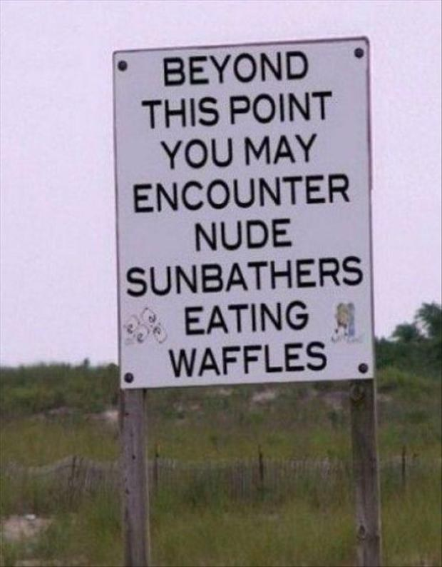
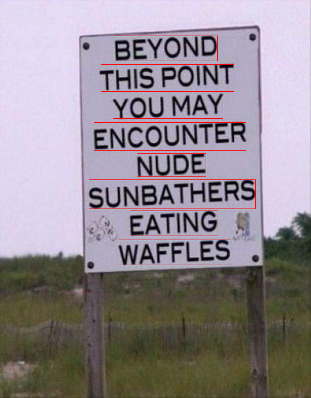

# stroke-width-transform

  [![NPM version][npm-image]][npm-url]
  [![build status][travis-image]][travis-url]
  [![npm download][download-image]][download-url]

Stroke Width Transform for detecting text on images using [CCV library](https://github.com/liuliu/ccv) and it's [Javascript bindings](https://github.com/fta2012/ccv-js).

## Installation

`$ npm install --save stroke-width-transform`

## Usage

```js
import strokeWidthTransform from 'stroke-width-transform';
import Image from 'image-js';

const swtOptions = {
  interval: 1,
  minNeighbors: 1,
  scaleInvariant: true,
  direction: 0,
  sameWordThresh: [0.1, 0.8],
  size: 3,
  lowThresh: 124,
  highThresh: 204,
  maxHeight: 300,
  minHeight: 8,
  minArea: 38,
  letterOccludeThresh: 3,
  aspectRatio: 8,
  stdRatio: 0.83,
  thicknessRatio: 1.5,
  heightRatio: 1.7,
  intensityThresh: 31,
  distanceRatio: 2.9,
  intersectRatio: 1.3,
  elongateRatio: 1.9,
  letterThresh: 3,
  breakdown: 1,
  breakdownRatio: 1 
};

Image.load('myImage.png').then((image) => {
  var rois = strokeWidthTransform(image, swtOptions); // rois contains the regions with text
})
```

Sample input             |  Image with ROI's
:-------------------------:|:-------------------------:
  |  

## [API Documentation](https://image-js.github.io/stroke-width-transform/)

## License

  [BSD 3-clause License](./LICENSE)

[npm-image]: https://img.shields.io/npm/v/stroke-width-transform.svg?style=flat-square
[npm-url]: https://www.npmjs.com/package/stroke-width-transform
[travis-image]: https://img.shields.io/travis/image-js/stroke-width-transform/master.svg?style=flat-square
[travis-url]: https://travis-ci.org/image-js/stroke-width-transform
[download-image]: https://img.shields.io/npm/dm/stroke-width-transform.svg?style=flat-square
[download-url]: https://www.npmjs.com/package/stroke-width-transform
